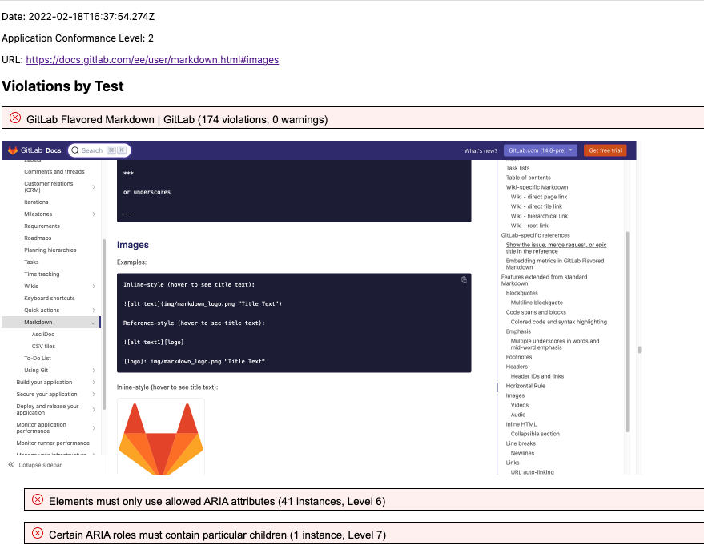

# Using the Accessibility Advisor report

This file will contain detailed instructions on what the report contains, how to interpret it, and
advice on resolving some of the identified issues.

## Overview of the report

(Here we will have a brief overview of what the report contains and how to explore the
details. Content is TBD.)

### Sample report

Below we have an image of a sample report from Accessibility Advisor. The rest of this section
provides a detailed description of what is shown in that image.

(Here we provide a point-by-point description of the image, both as an aid to understanding it and
to make this content accessible to people who cannot see the image. Full content is TBD.)

## Understanding an individual finding

(Here we will provide a summary of what each field in an individual violation means. Content is TBD.)

## How to resolve issues

(Here we will provide links to authoritative references such as the WCAG authoring guidelines,
etc. Content is TBD.)
